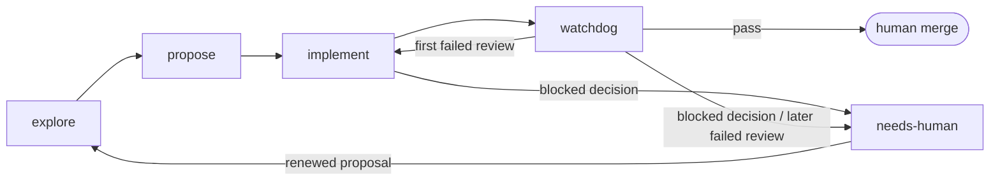

# skl

`skl` is a workflow engine for software changes made by coding agents. It started as a folder of personal skills and is no longer that. The deterministic parts of the workflow (which slice is eligible, who holds it, what state it moves to, what a handoff must contain) live in a Go binary. The agent keeps the judgment: designing, implementing, testing, reviewing. Records live in a private Git ledger. A human sits at the boundaries: deciding what to build, answering the questions automation cannot, and merging.

This is experimental. I built it for my own projects and I change direction often. Expect rough edges and breaking changes.

## Why not just skills

Most agent workflows are a folder of Markdown the model reads and interprets, with state kept in the source tree or in issue labels. That works until the workflow has to be reliable: two workers pick the same item, a review runs in the same context that wrote the code, a `done` label means three different things.

`skl` moves the deterministic part out of prose. Selection, Claims, state transitions, dependency gating and handoffs are engine operations that behave the same whichever harness runs the agent. What the agent receives is an Execution Skill: one Procedure with its facts already bound (the item, branch, worktree, exact Contract references, the next commands to run), composed with the Craft that step needs. Every command answers with an Outcome Instruction saying what happened and what to do next. The agent never navigates the ledger or keeps its own books.

The CLI is mostly for agents. Humans use `skl browse`, `skl decision inbox` and `skl ledger show`. The rest is what the installed entry points and skill stubs run.

## Where the ideas come from

Two projects shaped this and deserve the credit.

[OpenSpec](https://github.com/Fission-AI/OpenSpec) gave the staging: explore a change, freeze a proposal, implement against it. I customized my OpenSpec setup until it stopped being OpenSpec.

[Matt Pocock's skills](https://github.com/mattpocock/skills) gave most of the judgment guidance. `writing-for-agents` came from his repo nearly verbatim. `explore` descends from his `grill-with-docs`: interview relentlessly, map a design tree, write durable ADRs and a glossary as you go. `design`, `domain` and `testing` follow the shape and reference material of his skills. All of them have since been rewritten once to fit this workflow ([ADR 0008](docs/adr/0008-compose-execution-skills-from-procedures-and-craft.md)), so they are adapted, not copied.

What is mine is the rest: the engine, the private ledger, Claims, Watchdog Review as a separate fresh-context phase, Audit, the Decision Inbox, Supervisors and Dispatch, the harness adapters, Outcome Instructions, and the `brainstorm` and `shape` thinking tools.

## How a change flows

Each stage is a skill, entered cold and left behind at handoff. `propose` is the exception: it runs in the same session as `explore`.



| Stage | What it hands off |
|---|---|
| Explore | A shared understanding of the change, plus durable knowledge in `CONTEXT.md` and ADRs |
| Propose | Frozen, privately accepted tracer-bullet Contracts with explicit Dependencies |
| Implement | One claimed Slice implemented, verified, audited and recorded as awaiting review or needing a human |
| Watchdog | An independent private review and a verdict: ready for merge, rework, or needs human |
| Human merge | Final integration, Manual Verification and the merge itself |

- **Fresh contexts.** Handoff uses recorded evidence, not conversation history. Watchdog never runs in the context that built the change.
- **Private authority.** The ledger owns Slices, Claims, reports and Workflow State. Issues and PRs are human-facing attachments, never delivery authority.
- **Frozen Contracts.** Accepted obligations do not change. Changed obligations need a renewed proposal, not an edit.
- **Tracer bullets.** Each Slice cuts a demoable path through its layers. A dependent Slice becomes eligible only once every blocker is merged.

`brainstorm` and `shape` are optional thinking tools outside the pipeline. They preserve an open conversation or turn it into an implementation-independent design under `.thinking/`, which stays out of Git.

Supporting Craft is available on its own: `design` (deep modules and seams), `domain` (glossary and ADRs), `testing` (behavioral evidence), `audit` (independent Standards and Contracts review) and `writing-for-agents`.

## The private ledger

Everything the workflow has to trust is committed to one private Git repository, separate from the source repository and shared by every project on the machine ([ADR 0006](docs/adr/0006-store-workflow-records-in-a-private-git-ledger.md)). Source code stays where it is; the ledger holds the workflow.

```text
projects/<repository>/
  project.json
  proposals/<proposal>/
    proposal.json
    proposal.md
    <slice>/
      state.json              # Workflow State, Claim, branch, dependencies, attachments
      intent.md  behavior.md  # the frozen Contract
      plan.md    tasks.md     # when warranted
      implement-report.md     # once produced
      watchdog-report.md      # once produced
      decision.md             # when a human had to answer
  archive/<proposal>/
```

What this buys:

- **Work survives the forge.** Acceptance, Claims and handoffs commit locally first. Pushes and issue or PR updates come afterwards and may lag without blocking anyone.
- **Worker material stays private.** Contracts, phase reports, audit and review findings and human decisions never enter public history. Issues and PRs are a human-facing latest view of the local result, regenerated on demand ([ADR 0007](docs/adr/0007-keep-forge-publication-a-reconstructible-latest-view.md)).
- **Exact references.** Every report records the ledger commits and source revisions it consumed, and `skl ledger show` reads any of them back as they were.
- **Review from evidence.** Watchdog reads the frozen Contract and the implementation report, never the chat that produced the code.
- **One inbox across projects.** Every Slice waiting on a human decision shows up in `skl decision inbox`, whichever project it belongs to.
- **Browsable history.** `skl browse` walks projects, proposals and slices from committed records, without a forge ([ADR 0009](docs/adr/0009-separate-ledger-browsing-from-workflow-observation.md)).

## Execution Skills and harnesses

The prose an agent reads is authored under `prose/` as Procedures (one script per operation), Craft (judgment guidance written once), document templates and Outcome Instructions. It is embedded in the binary, and the engine composes it per invocation ([ADR 0008](docs/adr/0008-compose-execution-skills-from-procedures-and-craft.md), [docs/agent-prose.md](docs/agent-prose.md)).

`skl install` puts the workflow into Pi, Codex, Claude Code and OpenCode. Every skill gets a one-line stub that runs `skl skill <name>`. Implement and Watchdog are installed as Harness Adapters in each harness's native entry point (a Pi prompt template, a user-invoked Claude Code skill, an OpenCode command; Codex keeps a stub) and run `skl implement next` or `skl watchdog next`. Changing harness changes nothing about the workflow.

A Supervisor drains a queue by asking for work with `--dispatch`: the engine claims a Slice for a fresh worker session and answers with the command that session runs and the command that continues afterwards, which only proceeds once the ledger records that worker's handoff ([ADR 0010](docs/adr/0010-drive-supervisors-through-dispatch-outcomes.md)).

## Install

```sh
go install github.com/vicrdguez/skills/cmd/skl@latest   # or, from a checkout: go install ./cmd/skl
skl install    # stubs and entry points for the harnesses you have
```

Point `skl` at a private ledger clone. `skl` provisions no hosting and picks no default location:

```sh
git clone <private-ledger-remote> ~/workflow-ledger
mkdir -p "${XDG_CONFIG_HOME:-$HOME/.config}/skl"
printf '{"ledger": "%s/workflow-ledger"}\n' "$HOME" > "${XDG_CONFIG_HOME:-$HOME/.config}/skl/config.json"
```

Then bind each repository you want to work in:

```sh
skl setup    # AGENTS.md workflow block, .gitignore entries, GitHub labels for the public view
```

Rebuild the binary after editing anything under `prose/`; stubs and adapters read the running binary, not the checkout.

## Daily use

| Command | Who runs it | What it does |
|---|---|---|
| `skl implement next` | Implement entry point or Supervisor | Claims the next eligible Slice and returns its Execution Skill |
| `skl watchdog next` | Watchdog entry point or Supervisor, fresh session | Claims the next Slice awaiting review and returns its Execution Skill |
| `skl decision inbox` | Human, through the `decision` skill | Lists every request waiting on a human, with a bound command to answer it |
| `skl browse` | Human | Terminal browser over projects, proposals and slices |
| `skl ledger show` | Either | Reads a Contract, a phase report, or any exact ledger revision |

The full command reference is in [docs/cli.md](docs/cli.md).

## Further reading

- [CONTEXT.md](CONTEXT.md): the glossary every term above comes from
- [docs/adr/](docs/adr/): the decisions behind the shape of the workflow
- [docs/agent-prose.md](docs/agent-prose.md): how agent-visible prose is composed and measured
- [docs/report-schema.md](docs/report-schema.md): the phase report format
- [docs/cli.md](docs/cli.md): the command reference

MIT licensed.
