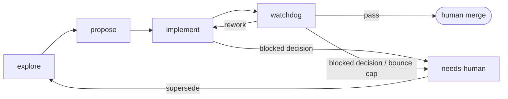

# Vic's skills repository

My collection of personal skills. These are heavily influenced by [OpenSpec](https://github.com/Fission-AI/OpenSpec) and [Matt Pocock skills](https://github.com/mattpocock/skills), mixing ideas from both.

I started customizing my OpenSpec workflow a lot, and eventually trying to incorporate Matt's ideas in it. It reached a point where I wanted to modify the skill files created by OpenSpec, so I decided to build the workflow on my own to make it easily installable in any of my projects.

In that sense, this collection is not inventing anything new but remixing mulitple ideas in a single bundle I can take anywhere. In fact, some Skill files are essentially verbatim from Matt's with maybe minor modifications to fit the pipeline

The only thing I'm bringing here is the way these ideas are remixed to work for me. So all props both projects.

## Optional thinking tools

`brainstorm` and `shape` are manually invoked thinking tools outside the development pipeline. `brainstorm` preserves an open-ended conversation; `shape` turns selected thinking into a faithful, implementation-independent design. Their artifacts stay local under `.thinking/`, excluded through Git's repository-local exclude, and are read only when their exact path is supplied.

## Why I'm not using Matt's skills directly

I think his skill repository is full of great ideas and skill implementations that I've benefited multiple times from. However I wanted mi pipeline to use different artifacts with different goals to aid Agent implementations, all while keeping a set of durable docs that persist across changes, even when those artifacts are deleted.

`grill-with-docs` is pretty much that idea, I'm just adding the concept of *Capabilities*, which is similar to what OpenSpec does with delta specs. My overall pipeline is also different so everything adapts to fit.


## The staged workflow

The collection is a pipeline of five stages. Each stage is a skill, entered cold and left behind when it hands off. The only exception is `propose`, that is run directly in the same session as `explore`:



| Stage | Skill | What it hands off |
|---|---|---|
| Explore | `explore` | Shared understanding through frontier rounds; durable docs written inline via `domain` |
| Propose | `propose` | Tracer-bullet vertical slices published to the board, each with its artifacts, branch and worktree |
| Implement | `implement` | One claimed slice, TDD'd at pinned seams, refactored via `audit`, PR labeled `review` |
| Watchdog | `watchdog` | A verdict reached in a fresh context — lands it (`done`) or bounces it (`rework`). Edits no code |
| Merge | human | The acceptance gate |

The rest are reference skills the stages pull in rather than stages of their own: `design` (deep modules and seams), `domain` (glossary, ADRs, capabilities), `tdd` (the red → green loop), `audit` (the two-axis review engine). `writing-for-agents` is a standalone reference for authoring skills and agent-facing docs.

Four rules hold it together:

- **A fresh context per stage.** Handoff happens through the board and the filesystem, never through conversation history. The watchdog is the strict case: it never runs in the context that built the change, so a green suite it did not run itself does not count.
- **The board is the queue.** GitHub issues and PRs carry the state — `ready` → `wip` → `review` → `done`, with `rework` for bounces and `needs-human` for the rare paused decision. One branch and one worktree per slice under `.worktrees/<slug>`, so slices don't step on each other.
- **Two document lifetimes.** Change artifacts (`intent.md`, `behavior.md`, and when warranted `plan.md` / `tasks.md`) live in `.changes/<slug>/` on the slice branch and are archived once the change lands. They freeze the moment they are published — ticking a box is the only edit anyone downstream may make, so the contract can't drift to meet whatever got built. Durable docs — `CONTEXT.md`, `docs/adr/`, `docs/capabilities/` — are committed to `main` and outlive every change that touched them.
- **Slices are tracer bullets.** Each one cuts a complete path through every layer, is demoable on its own, declares its blocking edges, and is sized to fit a single fresh context window.

### How this differs

**From OpenSpec** (`explore` → `propose` → `apply` → `archive`): the first two stage names are borrowed outright. The divergence is that `apply` splits into `implement` plus an adversarial `watchdog` stage and then the human merge — review becomes a stage with its own trust boundary instead of a step inside implementation. There is also no spec store: durable knowledge is `CONTEXT.md`, ADRs and capability docs on `main`, and in-flight state lives on the issue board rather than in a change folder.

**From Matt's skills**: his repo is a composable collection, you reach for whichever skill fits the moment. This is an ordered pipeline where each stage has entry and exit conditions, which is what makes the cold handoff between stages possible at all. Several skill files here are near-verbatim from his; the pipeline wrapped around them is the part I added.

## Installation

### Prepare a Consumer Repository

From this checkout, install the workflow executable and run Setup anywhere inside the target Git repository:

```sh
go install ./cmd/skl
skl setup
```

Use `skl setup --repo <path>` to target another checkout. If that repository has multiple GitHub remotes and no GitHub `origin`, select one with `--remote <name>`. Authentication is read from `GH_TOKEN`, then `GITHUB_TOKEN`, then `gh auth token`; Setup stores no credentials.

### Install skills

```sh
go install ./cmd/skl
skl install
```

`skl install` refreshes its owned Skill Stubs in Pi, Codex, and Claude Code without touching unrelated user files. Run `skl skill <name>` for rendered instructions, add `--format json` for the typed packet, or add `--resource <path>` for one named resource.

## Pi subagent loops

The Pi package uses [pi-subagents](https://github.com/nicobailon/pi-subagents) to drain each board queue sequentially. Install that extension separately with `pi install npm:pi-subagents`.

- `/implement-loop [max-items]` launches one fresh `implement-runner` per `ready` or `rework` item. A verified `review` handoff starts the next worker.
- `/watchdog-loop [max-items]` launches one fresh `watchdog-runner` per `review` item. A verified `done` or `rework` handoff starts the next worker.

Review findings carry stable per-PR IDs (`W1`, `W2`, …) so a round can be compared with the last one. The first watchdog review is complete; later rounds verify the open findings and read only what changed since the previous `Reviewed head`, and a second failing review pauses at `needs-human` rather than bouncing again. A verified `needs-human` is a complete handoff — the loop moves on, and nothing reclaims that item until a person does.

The scheduler and every worker have separate contexts. Run the two schedulers in different Pi sessions so implementation and review history never mix:

```sh
pi --name implement-loop --model openai-codex/gpt-5.6-luna --thinking medium
pi --name watchdog-loop --model openai-codex/gpt-5.6-luna --thinking medium
```

The worker defaults are:

| Agent | Model | Thinking | Fallback |
|---|---|---|---|
| `implement-runner` | `openai-codex/gpt-5.6-sol` | medium | `openai-codex/gpt-5.6-terra:high` |
| `watchdog-runner` | `openai-codex/gpt-5.6-sol` | high | `openai-codex/gpt-5.6-terra:high` |

For a critical watchdog run, override only that loop invocation:

```text
/watchdog-loop 10 model=openai-codex/gpt-5.6-sol:xhigh
```

The loop passes this as the `model` override on every fresh `watchdog-runner` launch; it does not change the saved default. The direct pi-subagents equivalent for one item is:

```text
/run watchdog-runner[model=openai-codex/gpt-5.6-sol:xhigh] "Load and follow the watchdog skill exactly. Process one eligible work item and exit."
```

Use `xhigh` for security, authorization, billing, destructive migrations, irreversible data operations, public API compatibility, or the watchdog's opt-in independent test reimplementation. Keep `high` for normal reviews: extra reasoning can otherwise increase latency and speculative edge-case findings.

Both loops stop when the queue is empty, their item limit is reached, or a claimed item has an incomplete or unverified handoff. A normal watchdog rejection that reaches verified `rework` is complete, so the loop continues.
