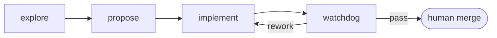

# Vic's skills repository

My collection of personal skills. These are heavily influenced by [OpenSpec](https://github.com/Fission-AI/OpenSpec) and [Matt Pocock skills](https://github.com/mattpocock/skills), mixing ideas from both.

I started customizing my OpenSpec workflow a lot, and eventually trying to incorporate Matt's ideas in it. It reached a point where I wanted to modify the skill files created by OpenSpec, so I decided to build the workflow on my own to make it easily installable in any of my projects.

In that sense, this collection is not inventing anything new but remixing mulitple ideas in a single bundle I can take anywhere. In fact, some Skill files are essentially verbatim from Matt's with maybe minor modifications to fit the pipeline

The only thing I'm bringing here is the way these ideas are remixed to work for me. So all props both projects.

## Why I'm not using Matt's skills directly

I think his skill repository is full of great ideas and skill implementations that I've benefited multiple times from. However I wanted mi pipeline to use different artifacts with different goals to aid Agent implementations, all while keeping a set of durable docs that persist across changes, even when those artifacts are deleted.

`grill-with-docs` is pretty much that idea, I'm just adding the concept of *Capabilities*, which is similar to what OpenSpec does with delta specs. My overall pipeline is also different so everything adapts to fit.


## The staged workflow

The collection is a pipeline of five stages. Each stage is a skill, entered cold and left behind when it hands off. The only exception is `propose`, that is run directly in the same session as `explore`:



| Stage | Skill | What it hands off |
|---|---|---|
| Explore | `explore` | Shared understanding, one question at a time; durable docs written inline via `domain` |
| Propose | `propose` | Tracer-bullet vertical slices published to the board, each with its artifacts, branch and worktree |
| Implement | `implement` | One claimed slice, TDD'd at pinned seams, refactored via `audit`, PR labeled `review` |
| Watchdog | `watchdog` | A verdict reached in a fresh context — lands it (`done`) or bounces it (`rework`). Edits no code |
| Merge | human | The acceptance gate |

The rest are reference skills the stages pull in rather than stages of their own: `design` (deep modules and seams), `domain` (glossary, ADRs, capabilities), `tdd` (the red → green loop), `audit` (the two-axis review engine).

Four rules hold it together:

- **A fresh context per stage.** Handoff happens through the board and the filesystem, never through conversation history. The watchdog is the strict case: it never runs in the context that built the change, so a green suite it did not run itself does not count.
- **The board is the queue.** GitHub issues and PRs carry the state — `ready` → `wip` → `review` → `done`, with `rework` for bounces. One branch and one worktree per slice under `.worktrees/<slug>`, so slices don't step on each other.
- **Two document lifetimes.** Change artifacts (`intent.md`, `behavior.md`, and when warranted `plan.md` / `tasks.md`) live in `.changes/<slug>/` on the slice branch and are archived once the change lands. Durable docs — `CONTEXT.md`, `docs/adr/`, `docs/capabilities/` — are committed to `main` and outlive every change that touched them.
- **Slices are tracer bullets.** Each one cuts a complete path through every layer, is demoable on its own, declares its blocking edges, and is sized to fit a single fresh context window.

### How this differs

**From OpenSpec** (`explore` → `propose` → `apply` → `archive`): the first two stage names are borrowed outright. The divergence is that `apply` splits into `implement` plus an adversarial `watchdog` stage and then the human merge — review becomes a stage with its own trust boundary instead of a step inside implementation. There is also no spec store: durable knowledge is `CONTEXT.md`, ADRs and capability docs on `main`, and in-flight state lives on the issue board rather than in a change folder.

**From Matt's skills**: his repo is a composable collection, you reach for whichever skill fits the moment. This is an ordered pipeline where each stage has entry and exit conditions, which is what makes the cold handoff between stages possible at all. Several skill files here are near-verbatim from his; the pipeline wrapped around them is the part I added.

## Installation
### Install with Pi

```sh
pi install git:github.com/vicrdguez/skills
```

### Install with Claude Code

```
/plugin marketplace add vicrdguez/skills
/plugin install skills@vicrdguez
```
